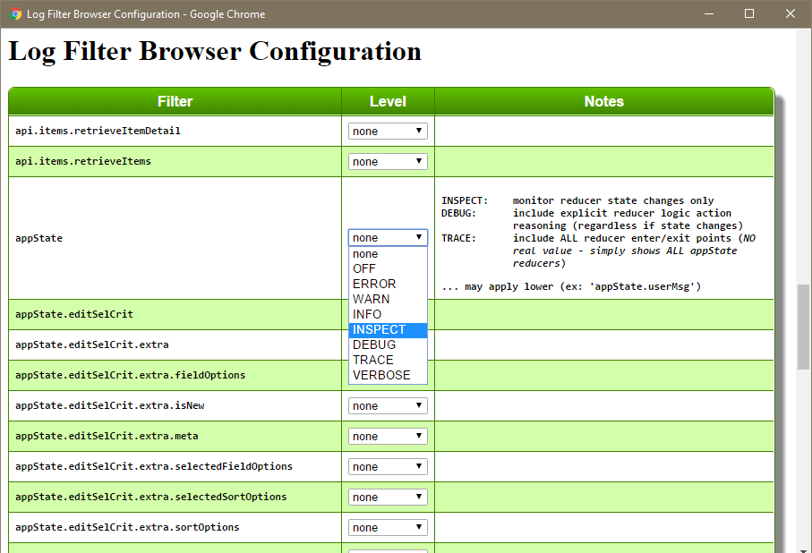

# Logging Extension

As a concrete example of extending astx-redux-util, let's explore a
real-world logging extension.  This example is taken directly from my
[GeekU](https://github.com/KevinAst/GeekU) app *(a sandbox project I use
to study various technologies and frameworks)*.

As it turns out, {{book.api.reducerHash}} is a **very central
component to most state changes**.  An overwhelming majority of time
that state changes, it is accomplished by a handler that passes
through {{book.api.reducerHash}}.  *In other words the
{{book.api.reducerHash}} is a clearing house for most state changes*.
In addition, {{book.api.reducerHash}} has a distinct advantage of
knowing several unique operational aspects, such as:

 - whether a handler wishes to operate on the state
 - and the before/after state of a handler operation

As a result, {{book.api.reducerHash}} can play a key roll in implementing a
centralized reducer-based logging utility.  The logging extension
shown here achieves the following advanced characteristics:
 - a central location to log reduction-based probes
 - promotes a standardized format for reduction-based probes
 - dynamically alters the logging probe level based on whether
   the state has changed or not

This last point is a **key feature**.  The probe's logging level is
dynamically determined, based on whether the state has changed, and/or
whether a reducer-specific handler wishes to communicate some
information.  The **advantage** of this dynamic is that it **allows logging
filters to be configured at a very high-level** (i.e. for ALL reducers)
**with minimal output**, because the INSPECT level focuses exclusively on
reducers that have changed state.  This is a VERY USEFUL feature!

Logging levels that are used are:

```
INSPECT: monitor state changes only
DEBUG:   includes explicit reducer logic regardless of state changes
         ... monitors WHICH reducer reasoned about an action
TRACE:   includes ALL reducer enter/exit points 
         ... NOT much value: shows ALL state reducer
```

## SideBar: Logging

While logging may not be as fashionable as it once was, I believe that
logging can provide valuable insight into both development and
production diagnostics.

When it comes to state changing diagnostic tools, utilities such as
[redux-devtools](https://github.com/gaearon/redux-devtools) **provide
invaluable insight into state changes**, and can be used without any
tooling in your application code.  With that in mind, **logging** (when
done right) can **provide additional insight into "why" a state change
occurred**.

There are many logging utilities available.  A few features to
consider in your evaluation:

 - filterable probes, allowing each module to have an identity that is filterable
 - interactive configuration (out-of-the-box)
 - efficient pruning (minimizing probe overhead)
 - configurable 
   * filter levels
   * output format
   * output destination
 - etc.


## Extending reducerHash

Our logging extension wraps {{book.api.reducerHash}} as follows
([astx-redux-util_loggerPolyfill.js](https://github.com/KevinAst/GeekU/blob/master/src/client/startup/astx-redux-util_loggerPolyfill.js)):

```js
// value-added reducerHash.withLogging()
// ... a wrapper TO reducerHash() - a higher-order function (HOF)
//     - WITH an additional parameter:
//        * log: {Log} the log to use in emitting reducer-based probes
//                     NOTE: the log's filterName is assumed to be the state element name
AstxReduxUtil.reducerHash.withLogging = (log, ...reducerHashArgs) => {

  // validate the supplied log parameter
  assert(log.reducerProbe,
         'AstxReduxUtil.reducerHash.withLogging() requires a log parameter with a log.reducerProbe() method.');

  // invoke the original reducerHash()
  const reducerFn = AstxReduxUtil.reducerHash(...reducerHashArgs);

  // expose actionHandlers ... used in additional logging characteristics
  const actionHandlers = reducerHashArgs[0];

  // wrap the resultant reducerFn to apply our value-added logging
  return (...reducerArgs) => {

    const state  = reducerArgs[0];
    const action = reducerArgs[1];

    // invoke the original reducerFn()
    // NOTE1: The es6 rest syntax accommodates astx-redux-util's
    //        additional "originalReducerState" argument
    // NOTE2: Result (via this extension) is expected to be:
    //        [nextState, logMsgFn|null]
    const reducerResult   = reducerFn(...reducerArgs);
    const handlerInvolved = actionHandlers[action.type] ? true : false;
    const [nextState, logMsgFn] = handlerInvolved
                                   ? reducerResult
                                   : [reducerResult, null]; // pass-throughs return the same state
                                                            // (i.e. NOT wrapped in array)
    // emit our standardized reducer-based logging probe
    log.reducerProbe(action, state!==nextState, logMsgFn);

    return nextState;
  };

};
```

The inline comments should be self-explanatory, but here are some
high-level points of interest:

- The `withLogging` extension is cataloged on the {{book.api.reducerHash}}
  function itself, making it directly available from the
  'astx-redux-util' import.  You may choose to make this it's own
  separate module.

- The logging process requires addition information (i.e. the log
  object) which is passed as a parameter, along with the
  {{book.api.reducerHash}} parameters.  The log's filterName is
  assumed to be the state element name.

- The wrapper invokes the underlying {{book.api.reducerHash}}
  function, and in turn, wraps the created reducer function.

- The **reducer wrapper** is where the **real enhancement is implemented**.

  * The **expectations of each handler is enhanced** by allowing it to
    promote BOTH the **nextState**, along with a **logging probe** (which
    makes up part of the overall probe).  An array is used to
    accumulate both these pieces of information.

  * The logging probe is generated through the enhanced
    log.reducerProbe() method *(detailed next)*.


## log.reducerProbe()

We also polyfill our Log object with the `log.reducerProbe()` method
that standardizes ALL reducer-related logging probes
([astx-redux-util_loggerPolyfill.js](https://github.com/KevinAst/GeekU/blob/master/src/client/startup/astx-redux-util_loggerPolyfill.js)):

```js
Log.prototype.reducerProbe = function(action, stateChanged, reducerMsgFn) {
  const logLevel = (stateChanged)
                     ? Log.INSPECT   // state change
                     : (reducerMsgFn)
                        ? Log.DEBUG  // no state change, but app-specific logic
                        : Log.TRACE; // no state change, and no app-logic

  // emit the "dynamic" logging probe
  this.log(logLevel, ()=> {
    const stateChangedMsg = stateChanged
                             ? 'STATE CHANGED'
                             : 'STATE UN-CHANGED';
    const reducerMsg      = reducerMsgFn
                             ? `,  Reducer Msg: ${reducerMsgFn()}`
                             : '';
    // ex: STATE CHANGED: appState.editSelCrit.extra.fieldOptions,  Action: 'selCrit.edit',  Reducer Msg: set fieldOptions from action
    return `${stateChangedMsg}: ${this.filterName},  Action: '${action.type}'${reducerMsg}`;
  });
};
```

A **key aspect** passed to this method is **an indicator of whether the
state has changed**, which dynamically alters the logging level, as
follows:

```
INSPECT: monitor state changes only
DEBUG:   includes explicit reducer logic regardless of state changes
         ... i.e. monitor WHICH reducer reasoned about an action
TRACE:   includes ALL reducer enter/exit points 
         (NOT much value, shows ALL state reducer)
```


## Usage

From a usage perspective, simply replace {{book.api.reducerHash}}
invocations with `reducerHash.withLogging()` and pass the appropriate
log parameter in addition to the reducerHash arguments.

The following reducer is the real code that our
{{book.guide.fullExample}} was derived from *(conceptually replace
`widget` with `selCrit`)*.  The actual code can be found at
[appState.editSelCrit.selCrit.js](https://github.com/KevinAst/GeekU/tree/master/src/client/state/appState.editSelCrit.selCrit.js)
*(all reducers are found at
[GeekU/src/client/state](https://github.com/KevinAst/GeekU/tree/master/src/client/state))*.


```js
import * as Redux       from 'redux';
import * as AstxRedux   from 'astx-redux-util';
import {AT}             from '../actions';
import SelCrit          from '../../shared/domain/SelCrit';
import Log              from '../../shared/util/Log';

import placebo  from './placeboReducer';
import name     from './appState.editSelCrit.selCrit.name';
import desc     from './appState.editSelCrit.selCrit.desc';
import fields   from './appState.editSelCrit.selCrit.fields';
import sort     from './appState.editSelCrit.selCrit.sort';
import filter   from './appState.editSelCrit.selCrit.filter';
import distinguishMajorSortField from './appState.editSelCrit.selCrit.distinguishMajorSortField';

const log         = new Log('appState.editSelCrit.selCrit');
const log4curHash = new Log('appState.editSelCrit.selCrit.curHash');

export default AstxRedux.joinReducers(
  // FIRST: determine content shape (i.e. {} or null)
  AstxRedux.reducerHash.withLogging(log, {
    [AT.selCrit.edit]:       (selCrit, action) => [action.selCrit, ()=>`set selCrit from action.selCrit: ${FMT(action.selCrit)}`],
    [AT.selCrit.edit.close]: (selCrit, action) => [null,           ()=>'set selCrit to null'],
  }),
  AstxRedux.conditionalReducer(
    // NEXT: maintain individual selCrit fields
    //       ONLY when selCrit has content (i.e. is being edited)
    (selCrit, action, originalReducerState) => selCrit !== null,
    AstxRedux.joinReducers(
      Redux.combineReducers({
        _id:      placebo,
        key:      placebo,
        userId:   placebo,
        itemType: placebo,
        lastDbModDate: placebo,

        name,
        desc,

        fields,
        sort,
        distinguishMajorSortField,
        filter,

        dbHash:  placebo,
        curHash: placebo,
      }),
      AstxRedux.conditionalReducer(
        // LAST: maintain curHash
        //       ONLY when selCrit has content (see condition above) -AND- has changed
        (selCrit, action, originalReducerState) => originalReducerState !== selCrit,
        (selCrit, action) => {
          const priorHash = selCrit.curHash;

          selCrit.curHash = SelCrit.hash(selCrit); // OK to mutate (because of changed instance)

          log4curHash.reducerProbe(action,
                                   priorHash !== selCrit.curHash,
                                   ()=>`resetting selCrit.curHash (because selCrit changed) FROM: '${priorHash}' TO: '${selCrit.curHash}'`);
          return selCrit;
        })
    )
  ), null); // initialState
```

Notice:

- By using `reducerHash.withLogging()` we tap into our centralized
  reducer-based logging utility.
  
- Each reducerHash handler, now returns both the **nextState** along
  with a **logging probe** *(wrapped in an array)*.

- The `log4curHash.reducerProbe()` can also be used outside of
  {{book.api.reducerHash}} control *(promoting standardized
  reducer-based logging probes anywhere)*.


## Demo

By way of demonstration, a picture is worth a thousand words.  Our
logger has a **hidden easter egg** that when invoked, **activates an
interactive logging configuration dialog**.



By setting our appState root filter to INSPECT, our logging probes are
limited to **just the reducers that have changed state**:


